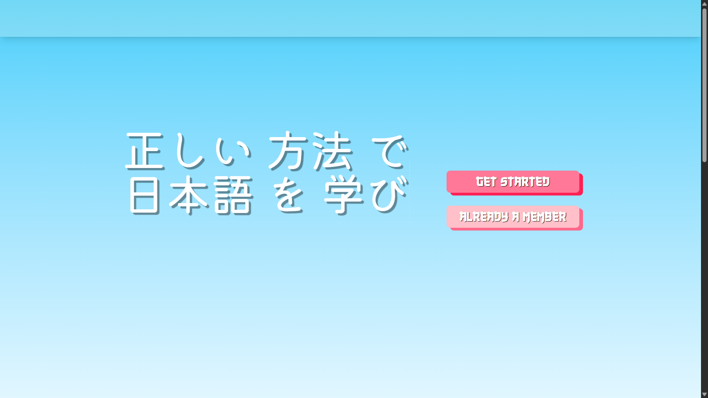
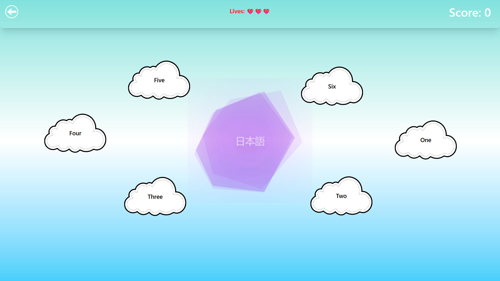
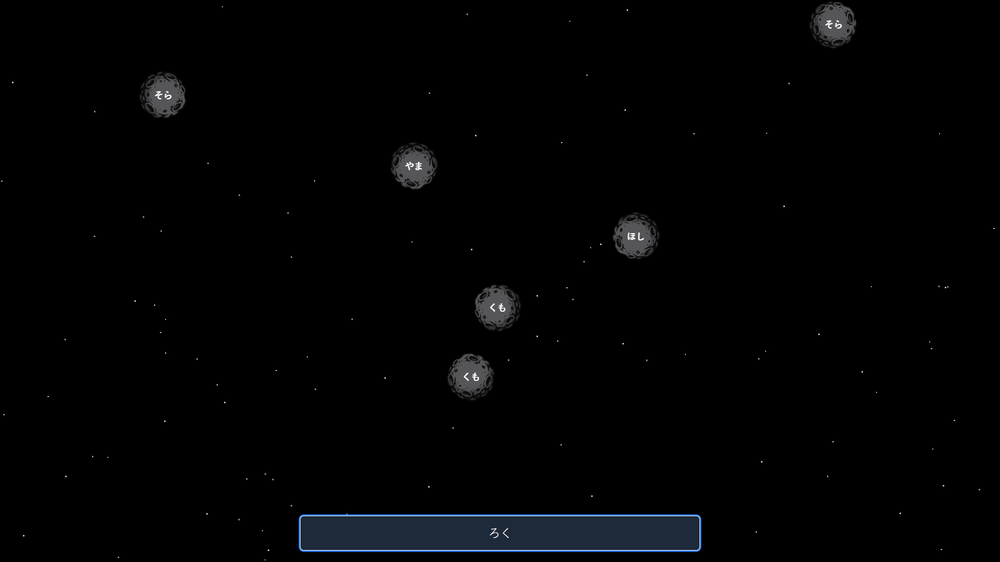

# LanguageLearning

**LanguageLearning** is a platform that creates a 🎮 **gamified experience** for mastering Japanese. Combine fun with productivity as you engage with interactive content, spaced repetition algorithms, and AI tools designed to make language learning effective and enjoyable!

## 🚀 Key Features

- 🎯 **Streaks:** Build daily practice habits and track your learning consistency.
- 🏅 **Badges & Achievements:** Earn badges and rewards as you reach milestones.
- ⚡ **XP & Level System:** Gain experience points for lessons, quizzes, and challenges.
- 🗣️ **Text-to-Speech (TTS):** Hear natural Japanese pronunciation for any learning content.
- 📝 **Speech-to-Text (STT):** Practice speaking and get instant feedback on your pronunciation.
- 🕹️ **Minigames & Challenges:** Boost retention with interactive games and challenges.
- 📈 **Progress Tracking:** Visualize your learning progress over time.
- 👥 **Leaderboards:** Compete with friends and learners globally.
- 📚 **Rich Content Library:** Access lessons, stories, and quizzes from beginner to advanced.
- 💬 **Real-Time Chat:** Chat with others in Japanese with AI-powered suggestions.
- 🃏 **Flashcards:** Master vocabulary via visual and auditory flashcards.
- 📖 **Interactive Story Reading:** Enjoy narrated stories with a scrollable, interactive UI.
- ⏰ **Spaced Repetition:** Smart review scheduling for maximum retention.
- 🤖 **AI-Powered Hints:** Get context-aware hints when you’re stuck.
- 🎓 **Personalized Learning Paths:** Get content tailored to your skill and goals.

## App Architecture Prototype

## Prototype Screenshots

## 🛠️ Getting Started

...

