# 日本語 Lab — Language Learning

Gamified Japanese learning platform: **FSRS spaced repetition** as the memory spine, XP / streaks / skill levels across every mode, AI conversation with ミケ, real-time chat, listening cloze, levelled storybooks, and vocab games.

**Live demo**
- Frontend: [language-learning-blue.vercel.app](https://language-learning-blue.vercel.app/)
- API: [languagelearning-55vm.onrender.com](https://languagelearning-55vm.onrender.com)

> **Note:** Render free tier sleeps when idle. The first request after a quiet period can take **~30–60s** while the server wakes up.

---

## Screenshots

### Architecture

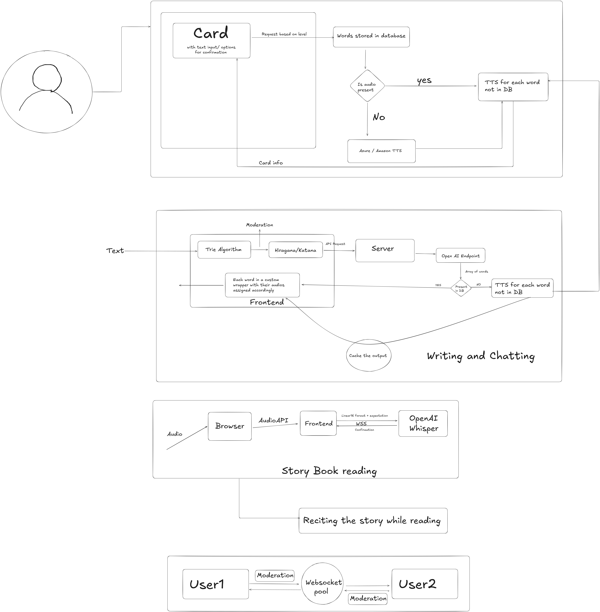

### Home & account

| Light home | Dark home | Account · multi-device sessions |
| :---: | :---: | :---: |
| 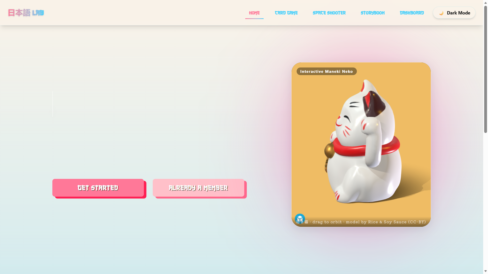 | 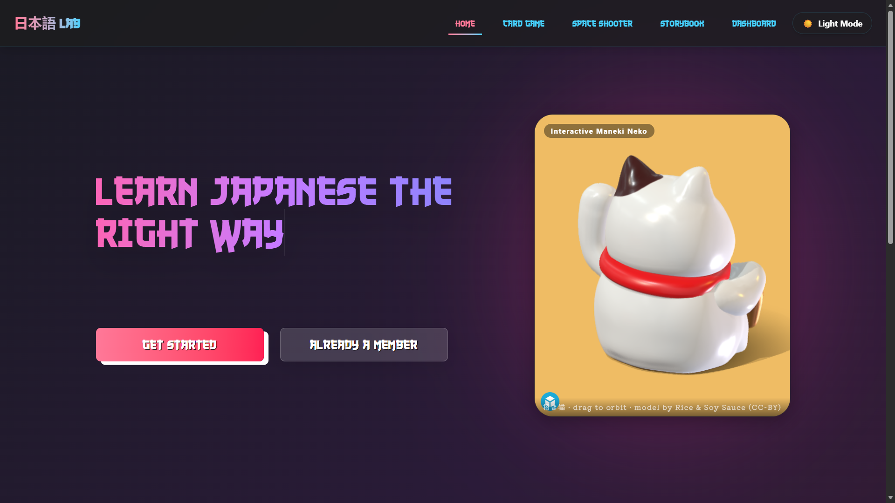 | 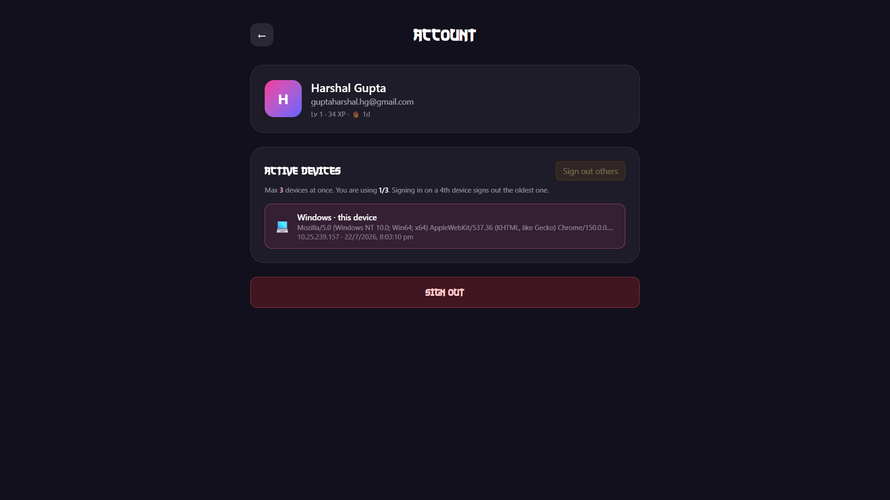 |

### Progress & SRS

| Daily quests | SRS deck (FSRS) |
| :---: | :---: |
| 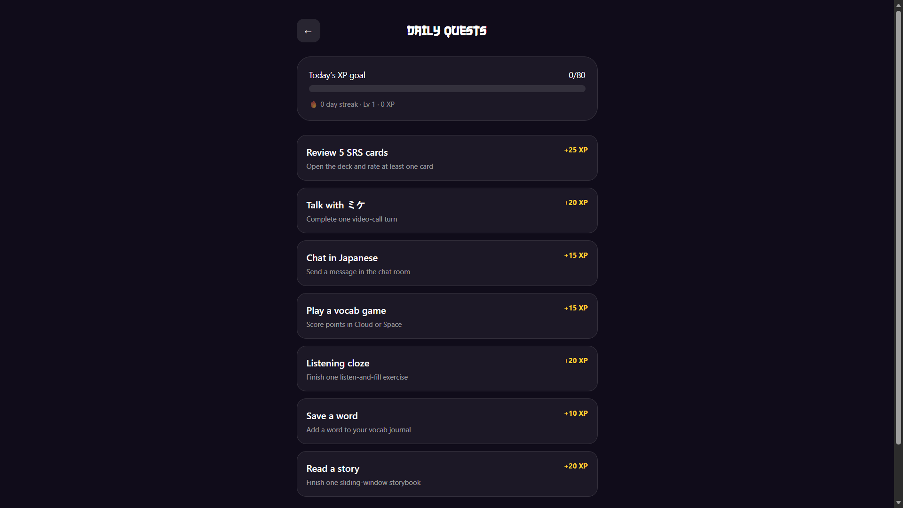 | 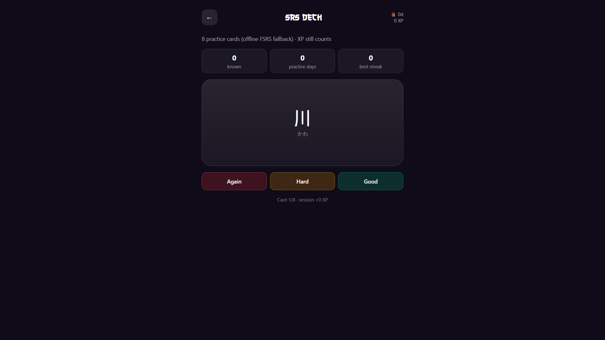 |

### Talk with ミケ (video-call practice)

| Setup | Live call | Coaching turn |
| :---: | :---: | :---: |
| 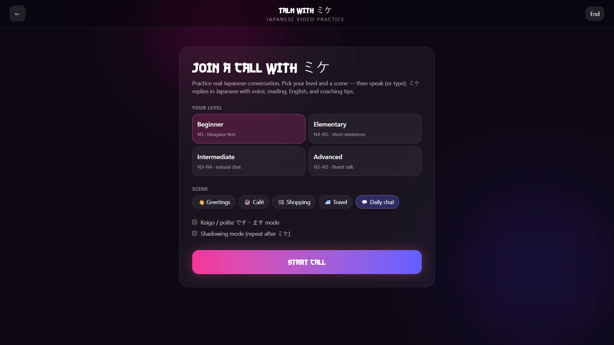 | 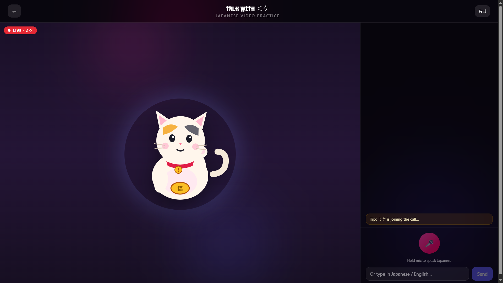 | 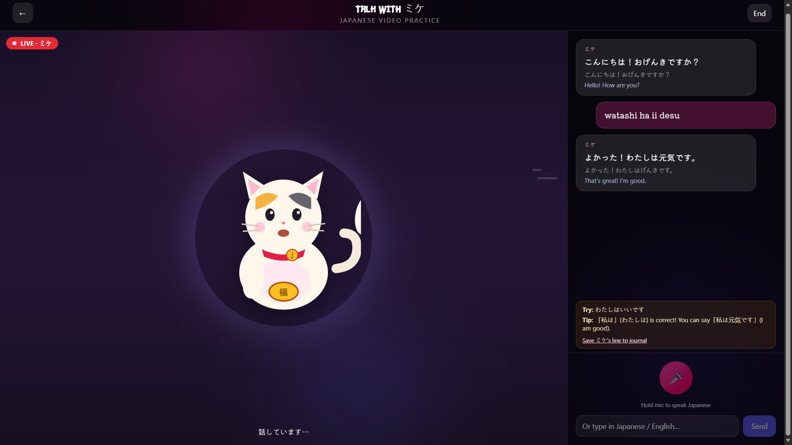 |

### Chat room · Storybook · Games

| Chat (romaji → Japanese) | Story library | Sliding-window reader |
| :---: | :---: | :---: |
| 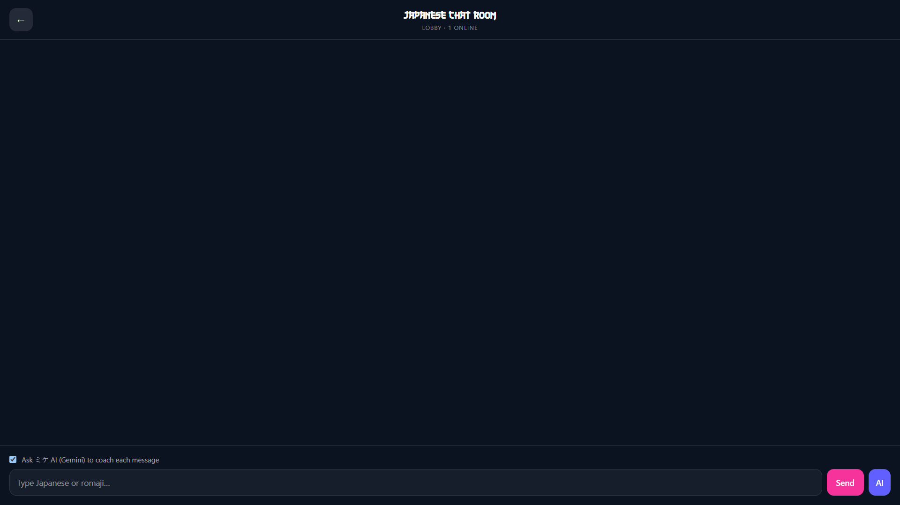 | 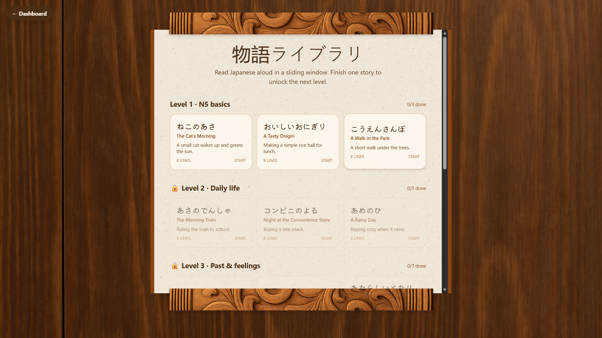 | 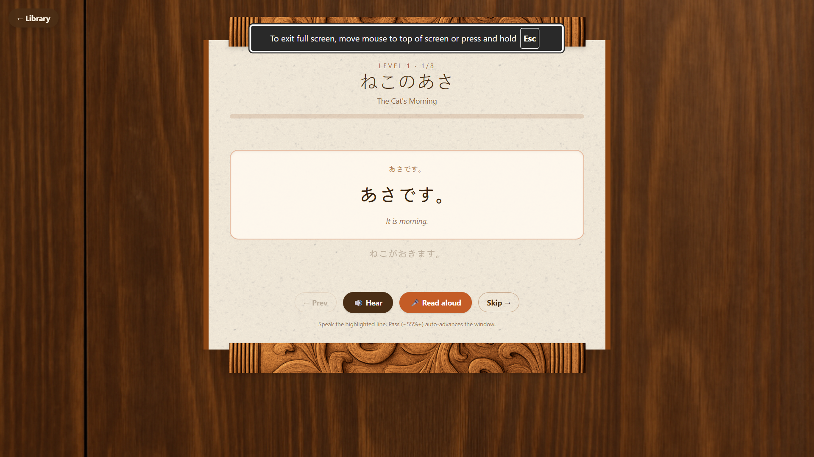 |

| Read-aloud scoring | Sky Orb (cloud game) | Orbital Kana Assault |
| :---: | :---: | :---: |
| 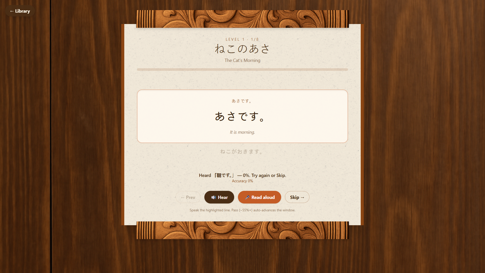 | 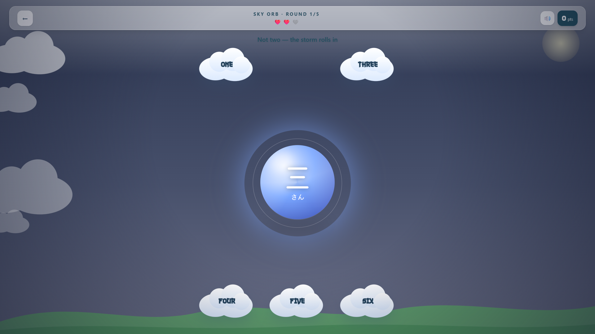 | 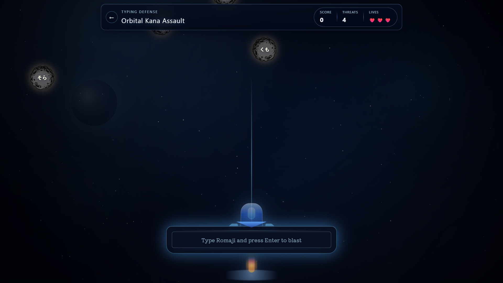 |

---

## What it does

| Feature | What you practice |
| --- | --- |
| **SRS Deck** | FSRS flashcards (Again / Hard / Good). Offline fallback deck if the Python scheduler is cold. |
| **Talk with ミケ** | Video-call style conversation — levels, scenes, keigo & shadowing, mic or type, TTS + coaching tips. |
| **Chat Room** | Real-time Socket.io lobby; type Japanese or romaji (Wanakana); optional Gemini coach. |
| **Storybook** | 15 seeded stories across 5 levels; sliding-window read-aloud with Hear / mic / Skip. |
| **Listening Cloze** | Hear a sentence (TTS), fill the blank. |
| **Sky Orb** | Drag meaning-clouds into the orb — sakura on correct, thunder on wrong. |
| **Space Shooter** | Type romaji to blast kana asteroids under time pressure. |
| **Vocab Journal** | Save words from practice; feeds daily quests. |
| **Daily Quests · Badges · Level Tracker** | Shared XP / streak / per-skill progress (vocab, speaking, listening, writing, reading). |
| **Auth** | JWT + Redis `jti` sessions, max **3 devices**, sign out others. |

---

## Architecture

Three services, two data stores:

```text
┌─────────────────┐     ┌──────────────────────┐     ┌─────────────────────┐
│  React (Vercel) │────▶│  Node / Express API  │────▶│ Python FSRS (Render)│
│  Vite + Tailwind│     │  (Render)            │     │ FastAPI + fsrs      │
└─────────────────┘     └──────────┬───────────┘     └─────────────────────┘
                                   │
                    ┌──────────────┼──────────────┐
                    ▼              ▼              ▼
               MongoDB Atlas   Upstash Redis   OpenAI / Gemini
               (Prisma)        sessions, RL,   TTS, talk, coach
                               quests, chat
```

- **Frontend** never talks to Python or DBs directly — only to Node `/api/v1`.
- **FSRS scheduler** is stateless: Node sends scheduler state + completed cards, persists the reply in Mongo.
- **Progress spine:** every mode calls `awardProgress({ xp, source })` → overall level, streak, and skill buckets.

### Per-source SRS profiles

The same “correct” answer is different evidence of memory. Node maps outcomes per mode before FSRS rates them:

| Source | Correct feels like | Why |
| --- | --- | --- |
| SRS deck | Easy (or Hard if chosen) | Self-graded recall |
| Sky Orb | Good | Multiple-choice recognition |
| Space shooter | Easy | Timed production |
| Talk | Easy (Hard if corrected) | Spoken production |
| Chat | Good | Assisted typing |
| Listen / Story | Good | Comprehension / reading |

---

## Repo layout

```text
LanguageLearning/
├── Frontend/                 # React + Vite + Tailwind
├── Backend/
│   ├── node/                 # Express API, Prisma, Socket.io
│   │   ├── prisma/
│   │   └── src/
│   └── python/Scheduler/     # FastAPI FSRS service
├── docs/screenshots/         # Prototype screenshots for this README
└── README.md
```

---

## Tech stack

| Layer | Stack |
| --- | --- |
| Frontend | React, TypeScript, Vite, Tailwind, Framer Motion, React Router, Recoil, Socket.io client, Wanakana, R3F (home mascot) |
| API | Node.js, Express, TypeScript, Prisma, MongoDB, Upstash Redis, Socket.io, OpenAI, Gemini |
| Scheduler | Python 3.12, FastAPI, Uvicorn, Pandas, **fsrs** |

---

## Local development

### Prerequisites

- Node.js 18+
- Python 3.12 (scheduler)
- MongoDB Atlas (or local Mongo)
- Upstash Redis (or compatible Redis REST)
- `OPENAI_API_KEY` (TTS + Talk)
- Optional: `GEMINI_API_KEY` (chat coach)

### 1. Install

```bash
cd Frontend && npm install
cd ../Backend/node && npm install
cd ../python/Scheduler && pip install -r requirements.txt
```

### 2. Environment — `Backend/node/.env`

```env
DATABASE_URL="mongodb+srv://..."
JWT_SECRET="long-random-secret"
REDIS_URL="https://....upstash.io"
REDIS_TOKEN="..."
OPENAI_API_KEY="sk-..."
GEMINI_API_KEY="..."          # optional — chat coach
FRONTEND_URL="http://localhost:5173"
SCHEDULER_URL="http://127.0.0.1:8000"
```

### 3. Run (three terminals)

```bash
# API
cd Backend/node && npm run dev

# FSRS scheduler
cd Backend/python/Scheduler && uvicorn app:app --host 0.0.0.0 --port 8000 --reload

# Frontend
cd Frontend && npm run dev
```

Frontend: `http://localhost:5173` · API: `http://localhost:3000/api/v1`

---

## Deploy

| Service | Host | Notes |
| --- | --- | --- |
| Frontend | **Vercel** | Root `Frontend/`. Set `VITE_API_URL=https://<node>.onrender.com/api/v1` |
| Node API | **Render** | Root `Backend/node`, Docker. Env: DB, Redis, JWT, `FRONTEND_URL`, OpenAI, Gemini, `SCHEDULER_URL` |
| Scheduler | **Render** | Root `Backend/python/Scheduler`, Python 3.12. Build: `pip install -r requirements.txt`. Start: `uvicorn app:app --host 0.0.0.0 --port $PORT`. **No env vars required.** |

Pin Python with `runtime.txt` (`python-3.12.8`). Free instances sleep — first SRS / login after idle can be slow; the app retries and shows a wake-up hint.

---

## API map (Node `/api/v1`)

| Area | Endpoints |
| --- | --- |
| Auth | `POST /users/signup`, `/login`, `/logout`, `GET /sessions`, `POST /logout-others`, `GET /me`, `/stats` |
| SRS | `POST /srs/bootstrap`, `GET /srs/overview`, `/cards`, `/progress`, `POST /srs/review`, `/ping` |
| Talk / chat | `POST /chat/character`, `DELETE /chat/character` · Socket.io chat rooms |
| Learning | `GET /learn/daily`, `/journal`, `/stories`, `POST /learn/stories/:id/progress`, listen + shadow routes |
| Audio | `POST /audio/TTS` |

### Scheduler (Python)

- `GET /health`
- `POST /initialize` · `/review` · `/getCards`

---

## Scripts

**Frontend:** `npm run dev` · `npm run build` · `npm run lint`

**Backend node:** `npm run dev` · `npm run build` (`prisma generate && tsc`) · `npm start`

---

## Design notes

- Theme is global (light/dark) via context — not per-page.
- Talk avatar is **2D** (SVG + Framer Motion); the home hero keeps the interactive 3D Maneki Neko.
- Rate limits protect free-tier Redis / OpenAI usage; auth and TTS quotas are tuned for demos.
- Story levels soft-lock: finish ≥1 story on level *N* to unlock *N+1* (15 stories seeded on first `/learn/stories` call).

---

## License

No explicit license has been provided in the repository.
